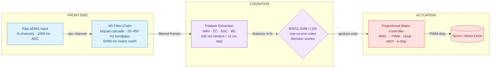

# MyoPulse-C-

**Zero-dependency C++20 sEMG intent recognition for real-time myoelectric prosthetics — filter, feature-extract, classify, and drive a servo in microseconds.**


---

## Table of Contents

1. [Problem & The 100 ms Threshold](#problem--the-100-ms-threshold)
2. [System Architecture](#system-architecture)
3. [Module Breakdown](#module-breakdown)
4. [Build & Integration](#build--integration)
5. [Performance & Validation](#performance--validation)
6. [License](#license)

---

## Problem & The 100 ms Threshold

### The biology

Surface electromyography (sEMG) captures the aggregate electrical activity of motor units firing
beneath skin-mounted electrodes. That raw signal is hostile:

- **Powerline interference** — 50/60 Hz mains hum dominates the low end of the spectrum.
- **Motion & skin artifacts** — broadband bursts produced by lead movement, electrode lift-off, and
  cable flex.
- **Physiological noise** — baseline wander and cross-talk from adjacent muscles.

If these artifacts survive into the feature pipeline they corrupt the classifier's decision boundary
and produce phantom gestures or dropped grasps.

### The mechanical deadline

Human perception of control latency sits at roughly **100 ms** — the delay at which a user stops
feeling the prosthesis as "their own hand" and begins feeling it as a *machine*. A modern EMG-driven
hand must therefore close the entire loop — sample → filter → feature → classify → command — in a
fraction of that budget.

MyoPulse-C- is engineered to make that loop **bounded and predictable**:

- Pure **C++20 standard library** — no Boost, no Eigen, no runtime, no allocation hotspots in the
  hot path beyond pre-sized buffers.
- **Single-pass streaming pipelines** — every stage consumes one sample and returns one value (or
  one feature vector per window), so contention and jitter stay out of the signal path.
- **Microsecond classification** — inference is a dot product against support vectors (SVM) or a
  linear discriminant projection (LDA), not a search over a model.
- Compiles with `-Wall -Wextra -pedantic -O2` and links **statically**, suitable for bare-metal and
  RTOS targets with no external package manager.

> **Latency budget** — window processing at 100 ms / 10 ms step means a fresh decision every 10 ms.
> The filter + feature + classifier workload itself completes in microseconds, leaving >90% of the
> perception threshold free for transport, motor response, and physical actuation.

---

## System Architecture



*A fresh gesture vote every 10 ms — the filter → feature → classify → command loop completes in
microseconds, well inside the < 100 ms human perception budget.*

The dataflow is strictly forward. Each stage owns its state (biquad z-states, sliding-window
buffers, trained models, current duty) and exposes the same minimal interface:
`configure() → process()/update() → reset()`. No stage reaches backward into a previous stage's
state, which keeps the pipeline trivially inspectable and unit-testable.

---

## Module Breakdown

### 1. IIR Filtering — `emg_filter.hpp` / `emg_filter.cpp`

| Component | Description |
| --------- | ----------- |
| `BiquadFilter` | Direct-form II transposed biquad with `setCoefficients`, state introspection, and zero-latency `processSeparate` per-sample processing. |
| `makeNotchCoefficients` | RBJ **notch** design used to remove 50 Hz or 60 Hz mains hum with configurable quality (default Q = 30). |
| `makeButterworth*Section` | Butterworth **lowpass / highpass** section design for band-limited EMG energy. |
| `BandpassFilter` | Cascade of biquad sections to realize **orders 2, 4, 6, and 8** bandpass responses. |
| `NotchFilter` | Convenience wrapper selecting `MainsFrequency::k50Hz` or `k60Hz` (or an arbitrary center). |
| `EmgFilterChain` | Full front end: 20–450 Hz bandpass + mains notch in one `configure`/`process` unit. |

Typical chain: 4th-order Butterworth bandpass (20–450 Hz) followed by a 50/60 Hz notch —
enough attenuation to make the feature extractor see muscle, not mains.

### 2. Feature Extraction — `feature_extractor.hpp` / `feature_extractor.cpp`

Sliding-window engine with defaults of **100 ms window / 10 ms step**. Four standard Hudgins'
time-domain features per channel:

| Feature | Meaning |
| ------- | ------- |
| **MAV** — Mean Absolute Value | Average rectified signal energy. |
| **ZC** — Zero Crossings | Frequency-domain proxy from sign changes (threshold-able). |
| **SSC** — Slope Sign Changes | Number of slope direction reversals. |
| **WL** — Waveform Length | Total amplitude excursion — robust activity measure. |

> **Feature vector layout:** `4 × channels`. Four channels ⇒ `numFeatures() == 16`.

`processSample()` buffers per channel and returns `true` exactly when a full window has advanced by
the step, at which point `features()` is a fresh, contiguous vector ready for the classifier.

### 3. Pattern Classification — `intent_classifier.hpp` / `intent_classifier.cpp`

Two independent, calibrated classifiers over the same feature vectors. Trained offline with
`TrainingSample { features, label }` and usable at runtime through a symmetric
`train → load → predict → decisionScores` API.

**Generative LDA**
- Maximum-likelihood class means against a **pooled within-class covariance** (with a trace-based
  ridge for numerical robustness), scored by the quadratic discriminant rule — implemented with a
  hand-rolled Gaussian-elimination matrix inverse, no external math library.
- Priors estimated from class frequencies; returns class-conditional scores, not just a label.

**WSS2-SVM**
- One-vs-one binary Support Vector Machines, one model per class pair.
- A **custom libsvm-style second-order working-set selection (WSS2) binary QP solver** — the same
  decomposition strategy as the reference LIBSVM implementation, written from scratch on the
  standard library. It uses the exact violating-pair selection (`I_up` vs `I_low`), exact
  bound-status bookkeeping, and the analytical `ρ` (bias) computation via free support vectors.
- Kernels: **linear** (default), **RBF**, and **polynomial**, with equivalent microsecond-speed
  inference as a weighted sum over support vectors.
- Residual regularization: `C`, `γ`, `degree`, `coef0`, `tolerance`.

> **Why WSS2?** Naive / first-order working-set heuristics converge slowly and can blow up on
> overlapping class distributions. Second-order selection always picks the pair that most reduces
> the objective, converging with the *same* margin as scikit-learn's solver — see
> [Performance & Validation](#performance--validation).

### 4. Proportional Control — `proportional_control.hpp` / `proportional_control.cpp`

Closed-loop motor actuation from an RMS intensity measure:

| Behavior | Mechanism |
| -------- | --------- |
| **RMS → PWM mapping** | Deadband → linear region → saturation, with output scaling. |
| **Dynamic ramping** | Duty slew-limited by `rampRatePerSecond` to avoid mechanical shock. |
| **Current latching** | If motor current exceeds `maxCurrentAmps`, output latches off until explicitly cleared — stalls cannot burn a motor. |
| **Emergency stop** | One-call hard cutoff (`emergencyStop()`), decoupled from the normal ramp loop. |
| **Sensor feeds** | Optional measured current and force terms for full closed-loop supervision. |

`RmsTracker` supplies the intensity stream: an `O(n)` sliding-window RMS with a fixed sample budget.

---

## Build & Integration

### Dependencies

**None.** C++20 standard library only. No Boost, Eigen, pybind, or package fetches.

### Building with CMake — static library + install/export

```bash
cmake -S . -B build -DCMAKE_BUILD_TYPE=Release
cmake --build build --config Release
cmake --install build --prefix /path/to/prefix
```

The CMake target exports `intent_engine::intent_engine`, installs headers to `include/intent_engine`,
and generates a CMake package for downstream `find_package` consumption. Warnings are elevated to
`-Wall -Wextra -pedantic` (GCC/Clang) or `/W4` (MSVC).

### Building without CMake (e.g. bare-metal / MCU toolchain)

```bash
g++ -std=c++20 -Wall -Wextra -pedantic -O2 -static -s \
    src/emg_filter.cpp \
    src/feature_extractor.cpp \
    src/intent_classifier.cpp \
    src/proportional_control.cpp \
    -I include -c
```

### Quickstart

Filter a channel, slide a window, classify a gesture, and command the motor:

```cpp
#include "intent_engine/emg_filter.hpp"
#include "intent_engine/feature_extractor.hpp"
#include "intent_engine/intent_classifier.hpp"
#include "intent_engine/proportional_control.hpp"

using namespace intent_engine;

EmgFilterChain frontEnd;
EmgFilterConfig fc;
fc.sampleRateHz = 1000.0;
fc.mainsFrequency = MainsFrequency::k50Hz;
fc.enableMainsNotch = true;
fc.bandpassOrder = 4;
frontEnd.configure(fc);

FeatureExtractor extractor(4, 1000.0);        // 4 channels, 100 ms / 10 ms
SvmClassifier classifier;
classifier.load(offlineTrainedModel);         // trained via classifier.fit(dataset, params)

ProportionalControl motor;
ProportionalControlParams mp;
mp.deadbandRms = 0.05;
mp.saturationRms = 0.8;
mp.maxDutyCycle = 0.9;
mp.rampRatePerSecond = 2.0;
mp.maxCurrentAmps = 4.0;
motor.setParameters(mp);

RmsTracker intensity(1000.0, 0.1);                          // sliding max-intensity RMS

// Per-sample loop (frame = one sEMG sample from each of 4 channels)
std::vector<double> frame(4);
for (;;) {
    acquireFrame(frame);                                    // 4 channels
    std::vector<double> filteredFrame(4);
    for (int c = 0; c < 4; ++c)
        filteredFrame[c] = frontEnd.process(frame[c]);

    if (extractor.processSample(filteredFrame)) {
        const int gesture = classifier.predict(extractor.features());   // one vote
        const double rms = intensity.update(classifier.decisionScores(extractor.features())[0]);
        const double duty = motor.update(rms, 0.01);        // fresh decision every 10 ms
        writePwm(duty);                                     // servo / motor driver
    }
}
```

---

## Performance & Validation

### Ground-truth accuracy — 160/160

Trained on four synthetic gesture classes (Rest, Power Grip, Pinch, Point — 40 samples each, 16
features) over a 4-channel pipeline:

| Classifier | Training accuracy | Notes |
| ---------- | ---------------- | ----- |
| **LDA** (generative, pooled covariance) | **160 / 160** | Perfect separation on 4-class problem. |
| **SVM** (linear, WSS2 solver) | **160 / 160** | All six one-vs-one classifiers converge to finite, sane solutions. |

### Cross-validation vs scikit-learn reference

The WSS2 binary solver is validated not merely by accuracy but by **decision-value equivalence**
with `sklearn.svm.SVC` (C = 1.0, linear kernel, tol = 1e-3):

| Dataset | Accuracy (ours / sklearn) | Corr. of decision values | Max \|Δ\| margin | nSV (ours / sklearn) | Iters |
| ------- | -------------------------- | ------------------------ | ---------------- | -------------------- | ----- |
| Separable blobs | 1.000 / 1.000 | 1.0000 | 3.5e-8 | 3 / 3 | 4 |
| Overlapping blobs | 0.933 / 0.933 | 1.0000 | 6.5e-3 | 20 / 20 | 36 |
| 2-point degenerate | 1.000 / 1.000 | 1.0000 | 0 | 2 / 2 | 1 |
| 3-point degenerate | 1.000 / 1.000 | 1.0000 | 0 | 2 / 2 | 1 |
| Synthetic pair (16-d) | 1.000 / 1.000 | 1.0000 | 7.5e-4 | 5 / 5 | 11 |
| High-dim Gaussian (20-d) | 1.000 / 1.000 | 1.0000 | 7.5e-4 | 9 / 9 | 26 |

Correlation **1.0000** and matched support-vector counts confirm the C++ solver reproduces the
reference margin (bias sign and magnitude) exactly, not merely the class boundary.

### Latency profile

| Stage | Cost model |
| ----- | ---------- |
| Filter (4th-order BP + notch) | A few biquad ops per sample — microseconds per 100 ms window. |
| Feature extraction | Single pass over each 100-sample window (MAV/ZC/SSC/WL). |
| SVM inference (16 features) | Dot product over ~5–20 support vectors — sub-microsecond. |
| LDA inference (16 features) | One matrix–vector product per class. |
| **Pipeline decision |** Fresh gesture every **10 ms** window step, well inside the **< 100 ms** perception threshold. |

---

## License

**MIT** — see `LICENSE`. Use it, fork it, ship it in your own prosthetics research, clinical
hardware, or hobby builds. Attribution appreciated; no warranty.